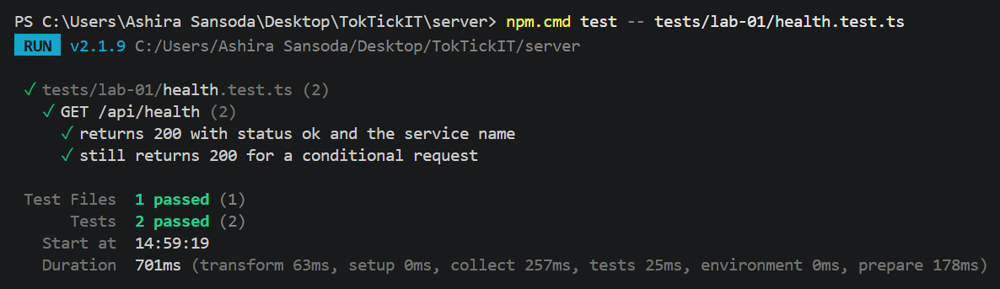
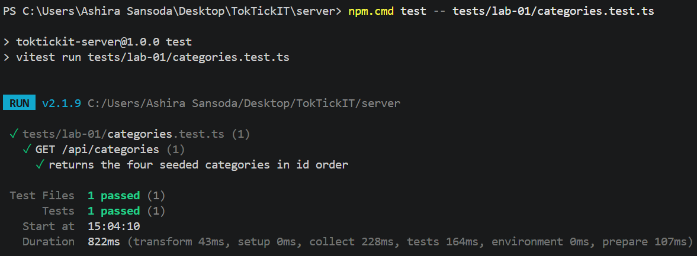
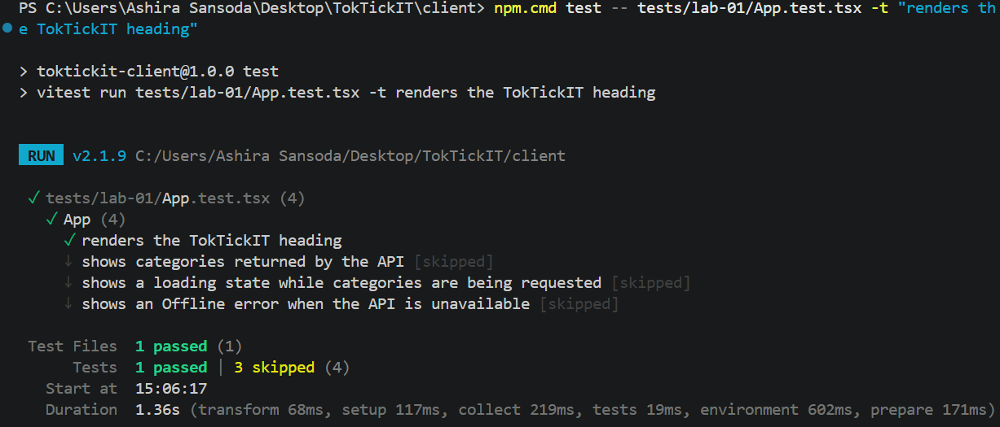
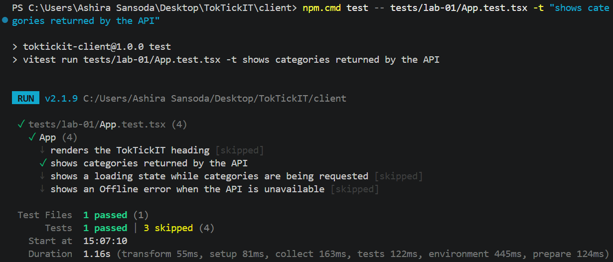
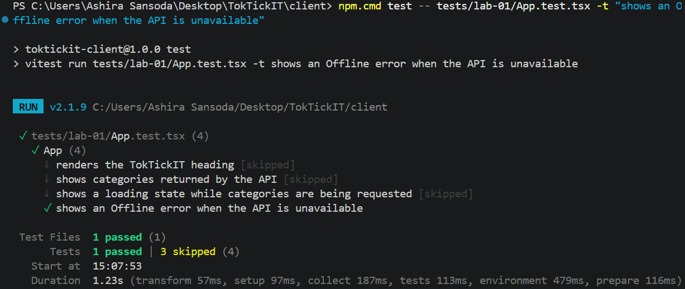

# Lab 1 — Test Plan and Evidence  (fill this in)

All test files live under server/tests/lab-01/ and client/tests/lab-01/.

| # | Tool | Test | Result |
|---|------|------|--------|
| 1 | Supertest | GET /api/health returns 200, status=ok | Passed |
| 2 | Supertest | GET /api/categories returns 4 seeded categories in id order | Passed |
| 3 | Vitest | Heading renders | Passed |
| 4 | Vitest | Success state shows Online + category list | Passed |
| 5 | Vitest | Error state shows Offline + message | Passed |

Paste your passing terminal output / screenshot below.

### Test screenshots

1. Health endpoint test

2. Categories API test

3. Heading test

4. Success-state test

5. Offline-error test

