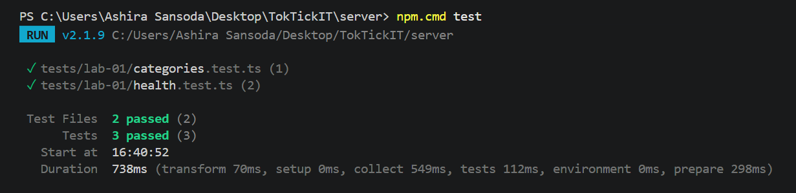
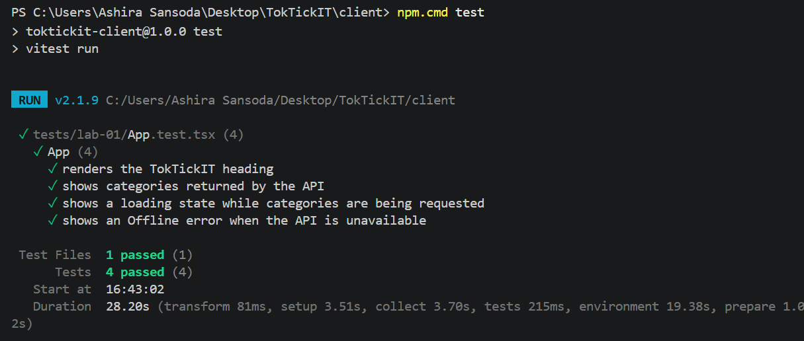
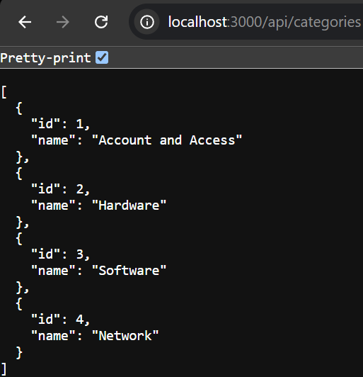
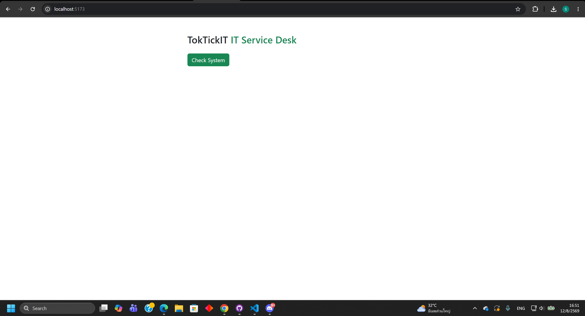
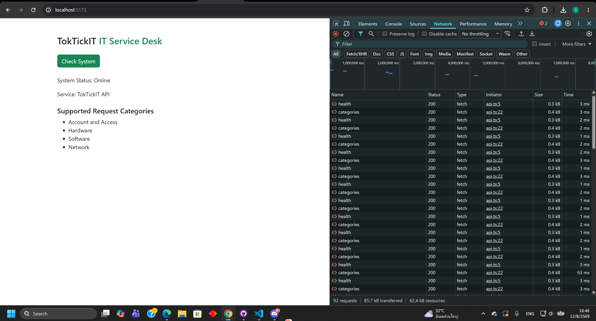
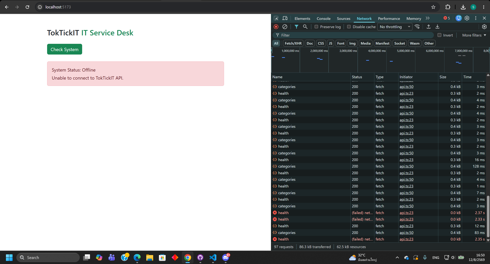

# Lab 1 - Test Plan and Evidence

All automated test files are under `server/tests/lab-01/` and `client/tests/lab-01/`.

| # | Tool | Test | Result |
|---|------|------|--------|
| 1 | Supertest | `server/tests/lab-01/health.test.ts`: `GET /api/health` returns HTTP 200 with `status: "ok"` and `service: "TokTickIT API"`. | Passed |
| 2 | Supertest | `server/tests/lab-01/health.test.ts`: a conditional health request still returns HTTP 200 and uses `Cache-Control: no-store`. | Passed |
| 3 | Supertest | `server/tests/lab-01/categories.test.ts`: `GET /api/categories` returns the four seeded categories in ascending ID order. | Passed |
| 4 | Vitest | `client/tests/lab-01/App.test.tsx`: the heading renders and the success state displays the API-returned categories. | Passed |
| 5 | Vitest | `client/tests/lab-01/App.test.tsx`: the loading state is shown and an unavailable backend displays Offline with a useful error message. | Passed |

## Verification commands

```powershell
cd server
npm.cmd test
npm.cmd run build
cd ..\client
npm.cmd test
npm.cmd run build
```

Recorded results:

- Server: 2 test files and 3 tests passed; TypeScript build passed.

- Client: 1 test file and 4 tests passed; production build passed.

- The live `GET /api/categories` check returned HTTP 200 with the four seeded categories.

- Heading renders

- Success state shows Online + category list

- Error state shows Offline + message
