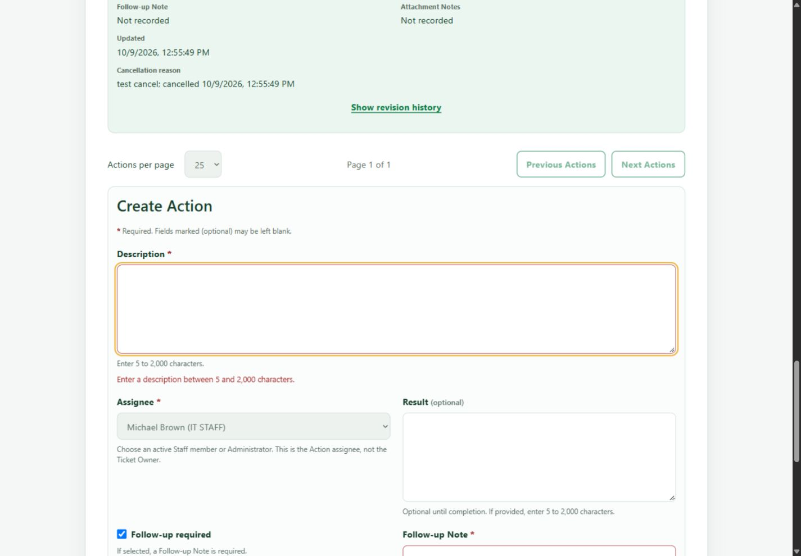
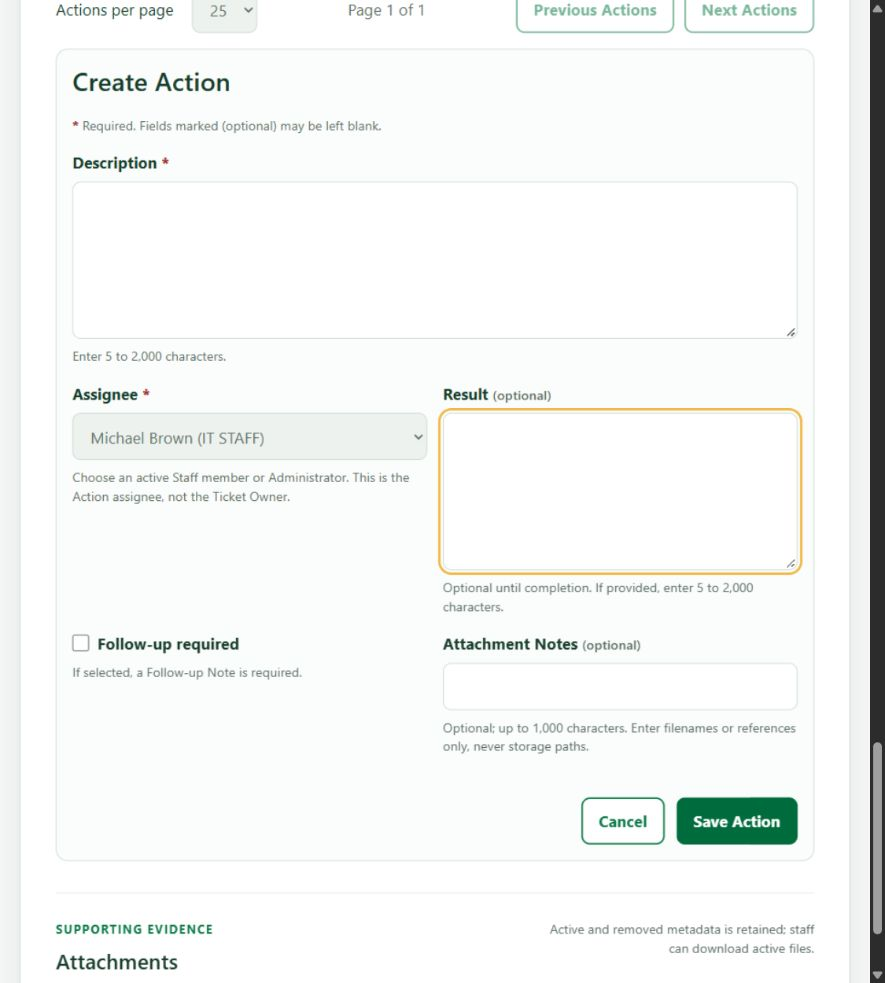
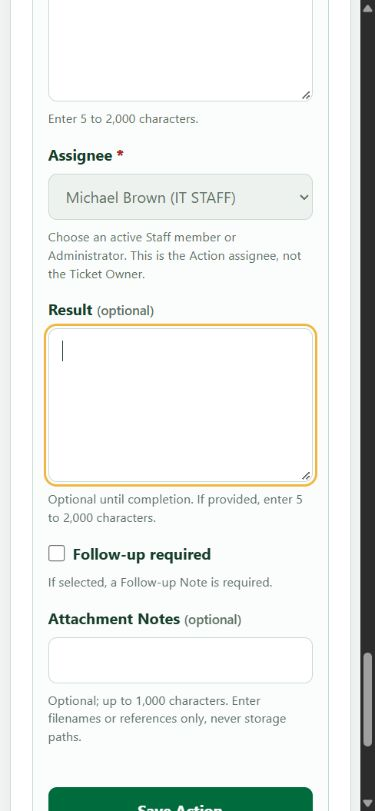

# Lab 4 Tests and Evidence

Issue #55 establishes the contract baseline. Issue #56 implementation evidence and the current Issue #57 UI worktree evidence are recorded in Section 4; later workflow, dashboard, and E2E evidence remains pending for its planned Issues. Normative requirements: [specification.md](specification.md); [API](api-spec.md); [UI](ui-spec.md). Each ID below maps to an intended concrete test path. **Planned** means no automated test for that row has been run; **Partial** means some but not all assertions for that row have been verified. Issue evidence names the subset actually covered. Never check an unobserved result or claim candidate output came from final `main`.

## 1. Planned test matrix

For compactness, the exact path prefixes in this table are `S = server/tests/lab-04/`, `C = client/tests/lab-04/`, and `E = e2e/lab-04/`; concatenate prefix and filename, not a glob. These are proposed files, not current files.

| Test ID | Type / exact planned path | Requirements and ACs | Required assertions | Status |
| --- | --- | --- | --- | --- |
| UNIT-01 | Unit; S`action-validation.unit.test.ts` | FR-02,05; BR-02,04,05,06; AC-02,03 | Trim boundaries, wrong types/unknown actor/date fields, default assignee, conditional note, Result completion and cancellation reason. | Partial: Issue #56 validation subset passed; full matrix remains open. |
| UNIT-02 | Unit; S`workflow-rules.unit.test.ts` | FR-04,07; BR-07,08,11,12,15; AC-05,07,08,10 | Every allowed/forbidden Action/Ticket transition, terminal edits, gate combinations, cancellation and legacy zero-Action rules. | Partial: Issue #56 Action rules passed; Ticket workflow/gate assertions remain open. |
| UNIT-03 | Unit; S`dashboard-calculations.unit.test.ts` | FR-09,10; BR-17,18; AC-11,13 | Distinct Tickets vs Actions, active states, zero counts, UTC seven-day edges/future dates, Asia/Bangkok display, deterministic ties. | Planned |
| API-01 | API; S`actions-taken.api.test.ts` | FR-01,02,03,04,05,06; BR-01–09; AC-01–05 | Real create/list/edit/assign/complete/cancel, Owner≠actors, completed correction with inactive assignee, actor active-role recheck inside each write transaction, immutable prefix snapshots, no-op, scoped pagination, validation and rollback. | Partial: implemented lifecycle subset plus stale-actor and inactive-assignee corrections passed; remaining lifecycle assertions stay open. |
| API-02 | API; S`authorization.api.test.ts` | FR-01,10,13,14; BR-01,03,16,22; AC-01,12,18 | Missing/expired/revoked/password-gated sessions, CSRF/Origin, Requester mutation403, own read, cross-owner/resource404, Staff/Admin access and sanitized errors. | Partial: Action-session, role, and ownership checks passed; full authorization matrix remains open. |
| API-03 | API; S`concurrency.api.test.ts` | FR-03,06,07,08; BR-09,10,12,14; AC-04,06,08 | Same-key concurrent create one row/revision; different payload409; replay after stale version; edit/edit, resolve/create, resolve/follow-up, assignment/Admin races; forced transaction failure; bounded conflict retry. | Partial: idempotency, stale replay, rollback, and assignment race passed; Ticket workflow races remain open. |
| API-04 | API; S`ticket-workflow.api.test.ts` | FR-07,08,12; BR-11–15; AC-07–10 | Full matrix, confirmation/reason, each gate predicate, event order, advisory indication, reopen clearing, terminal legacy behavior, atomic Ticket/Action cancellation rollback. | Planned |
| API-05 | API; S`requester-dashboard.api.test.ts` | FR-10,11; BR-16,18,19; AC-12–14 | Session scope, all owned statuses, exact metrics, bounds/ties/zero, attention and recent, shared filtered totals, unsupported identity query400. | Planned |
| API-06 | API; S`staff-dashboard.api.test.ts` | FR-09,11; BR-17–19; AC-11,13,14 | Unassigned/my-owned/urgent/distinct my-Action metrics, current-user Action rows, status/IT-priority counts, bounded lists, drill-down and Owner≠assignee. | Planned |
| API-07 | Migration/API; S`migration-regression.api.test.ts` | FR-07,12; BR-15,21; AC-10,16,17 | Apply the real Lab 4 migration to an actual pre-Lab-4 schema, preserve Ticket/Attachment/changed-password state; seed twice and after edits; collision skip; counter monotonic; backup/restore disposable rehearsal. | Partial: real migration and preservation plus repeat-seed checks passed; collision/counter and full recovery rehearsal remain open. |
| API-08 | API; S`user-assignment-safety.api.test.ts` | FR-02,13; BR-02,05,20; AC-02,15 | Inactive/non-staff assignee, User active-Action conflict and session unchanged, self/last-Admin and owned-Ticket precedence, eligible role change and historical actors, concurrent eligibility change. | Partial: active-Action deactivation/demotion protection and assignment race passed; remaining safety cases stay open. |
| PERF-01 | Performance-smoke; S`dashboard-performance.api.test.ts` | FR-09,10; BR-16–19; AC-13 | Representative 500-Ticket/1000-Action fixture; aggregate query count stays bounded as fixture doubles (no N+1), arrays capped5, response does not contain complete collections. Record elapsed diagnostics, no invented production SLA. | Planned |
| UI-01 | Component; C`ActionsTaken.test.tsx` | FR-01–06; BR-01–10,22; AC-01–06,19 | Inline create/edit, required/optional markers, conditional requirements, plain-language field errors/focus, Requester and terminal-Ticket read-only views, lifecycle confirmation/reason, stale-draft retention, safe retry with stable idempotency key, active assignee and User-management safety feedback. | Partial: 14 Action component tests pass, including history error/retry and empty Result; Staff detail tests cover all three terminal statuses. Focused Staff keyboard/responsive/revision browser checks passed before this review fix. Broader pagination, busy-guard and authenticated lifecycle E2E remain open. |
| UI-02 | Component; C`TicketWorkflow.test.tsx` | FR-07,08; BR-11–15,22; AC-06–10,19 | Legal target controls, gate explanation, confirmation/cancel reason, protected direct calls, reload on stale version, indication vs status, ordered history. | Planned |
| UI-03 | Component; C`RequesterDashboard.test.tsx` | FR-10,11,14; BR-16,18,19,22; AC-12–14,19 | Loading/zero/error/Retry/session expiry, correct owned cards/lists/links, time display, navigation/deep link and account-cache reset. | Planned |
| UI-04 | Component; C`StaffDashboard.test.tsx` | FR-09,11,14; BR-17–19,22; AC-11,14,19 | Current-user assigned Actions and real metric links, capped summaries, all states/refresh, role navigation, keyboard semantics. | Planned |
| STYLE-01 | Style/responsive; C`ZenGreen.styles.test.tsx` | FR-14; BR-22; AC-19 | Token and breakpoint/style contracts; browser visual/overflow/accessibility checks remain E2E/MAN, not jsdom viewport claims. | Partial: 3 style tests passed; real Staff Action forms inspected at desktop/tablet/mobile and breakpoint boundaries without page overflow. Full role/page visual and screen-reader checks remain open. |
| E2E-01 | Browser; E`actions-taken-flow.spec.ts` | FR-01–06,13,14; BR-01–10,20,22; AC-01–06,15,18 | Authenticate real roles; create multiple Actions on one Ticket, assign/edit/complete/cancel, inactive rejection, read-only Requester, conflict/retry and attachment continuity; assert actual persisted records. | Planned |
| E2E-02 | Browser; E`ticket-resolution.spec.ts` | FR-07,08,14; BR-11–15,22; AC-07–10,18 | Failed gate via direct API, complete/follow-up correction then resolve/close/reopen/cancel, confirmed transitions, retained events/revisions, advisory indication and legacy Ticket. | Planned |
| E2E-03 | Browser; E`dashboards.spec.ts` | FR-09–11,14; BR-16–19,22; AC-11–14,18,19 | Requester/Staff/Admin dashboard roles, metrics-to-list totals, real Action links, zero/failure, 3 sizes/boundaries, keyboard/axe and no page overflow. | Planned |
| REG-01 | Full prior/new suites; manifest and Lab 2 flow mapping below; planned e2e/lab-04/requester-regression.spec.ts | FR-07,12–14; BR-13,21,22; AC-09,16,18,20 | Full inherited server/client suites and authenticated equivalents of every retained Lab 2 browser flow, plus Lab 3/4 E2E; verify mapped scenarios actually pass, builds, migrations/repeat seed; no hidden skips. | Planned |
| DOC-01 | Manual/inline contract check; six files in docs/lab-04 | FR-14; BR-22; AC-20 | Presence, exact eleven specification headings, all IDs/paths mapped, exact APIs/decisions, labsheet rubric and peer approval order. Approval is separate from local structural success. | Committed-source green at `b9ebdc2`, exit0; PR #63 merged after student-accepted comment sign-off; no formal GitHub Approve claimed. |
| MAN-01 | Real captures/manual review; artifacts/lab-04/screenshots directories in ui-spec | FR-12,14; BR-21,22; AC-17,19,20 | Disposable recovery observation, role/metric API evidence, real readable responsive screenshots, focus/console/links, Project/history/review audit and nine-part submission. | Planned |

The eleven required files in labsheet §12 are API-01,04,05,06; UI-01,02,03,04; E2E-01,02,03. Additional focused tests cover explicit validation, authorization, concurrency, migration and performance requirements; they do not expand product scope.

## 2. FR/BR and AC traceability

The AC table in specification is authoritative; every AC-01–20 appears above with a path or genuine manual-evidence location. This direct index prevents a requirement disappearing between tables:

| AC | Test IDs (paths in §1) | Implementation acceptance status |
| --- | --- | --- |
| AC-01 | API-01,02; UI-01; E2E-01 | Planned |
| AC-02 | UNIT-01; API-01,08; E2E-01 | Planned |
| AC-03 | UNIT-01; API-01; UI-01; E2E-01 | Planned |
| AC-04 | API-01,03; UI-01; E2E-01 | Planned |
| AC-05 | UNIT-02; API-01; UI-01; E2E-01 | Planned |
| AC-06 | API-03; UI-01,02; E2E-01 | Planned |
| AC-07 | UNIT-02; API-04; UI-02; E2E-02 | Planned |
| AC-08 | UNIT-02; API-03,04; UI-02; E2E-02 | Planned |
| AC-09 | API-04; REG-01; E2E-02 | Planned |
| AC-10 | API-04,07; E2E-02 | Planned |
| AC-11 | UNIT-03; API-06; UI-04; E2E-03 | Planned |
| AC-12 | API-02,05; UI-03; E2E-03 | Planned |
| AC-13 | UNIT-03; API-05,06; PERF-01; E2E-03 | Planned |
| AC-14 | API-05,06; UI-03,04; E2E-03 | Planned |
| AC-15 | API-08; REG-01; E2E-01 | Planned |
| AC-16 | API-07; REG-01 | Planned |
| AC-17 | API-07; MAN-01 | Planned |
| AC-18 | API-02; REG-01; E2E-01,02,03 | Planned |
| AC-19 | UI-01,02,03,04; STYLE-01; MAN-01 | Planned |
| AC-20 | DOC-01; REG-01; MAN-01 | Contract checks underway; approval/release pending |

| FR | Test IDs | BR | Test IDs |
| --- | --- | --- | --- |
| FR-01 | API-01,02; UI-01; E2E-01 | BR-01 | API-01,02; UI-01 |
| FR-02 | UNIT-01; API-01,08; E2E-01 | BR-02 | UNIT-01; API-01,08 |
| FR-03 | API-01,03; UI-01; E2E-01 | BR-03 | API-01,02; UI-01 |
| FR-04 | UNIT-02; API-01; UI-01 | BR-04 | UNIT-01; API-01 |
| FR-05 | UNIT-01; API-01; UI-01 | BR-05 | UNIT-01; API-01,08 |
| FR-06 | API-01,03; UI-01; E2E-01 | BR-06 | UNIT-01; API-01; UI-01 |
| FR-07 | UNIT-02; API-03,04; UI-02; REG-01; E2E-02 | BR-07 | UNIT-02; API-01 |
| FR-08 | API-03,04; UI-02; E2E-02 | BR-08 | UNIT-02; API-01 |
| FR-09 | UNIT-03; API-06; PERF-01; UI-04; E2E-03 | BR-09 | API-01,03; UI-01 |
| FR-10 | UNIT-03; API-02,05; PERF-01; UI-03; E2E-03 | BR-10 | API-03; UI-01; E2E-01 |
| FR-11 | API-05,06; UI-03,04; E2E-03 | BR-11 | UNIT-02; API-04; UI-02 |
| FR-12 | API-04,07; REG-01; MAN-01 | BR-12 | UNIT-02; API-03,04; UI-02 |
| FR-13 | API-02,08; REG-01; E2E-01 | BR-13 | API-04; REG-01; E2E-02 |
| FR-14 | API-02; UI-01–04; STYLE-01; REG-01; DOC-01; MAN-01; E2E-01–03 | BR-14 | API-03,04; UI-02 |
| — | — | BR-15 | UNIT-02; API-04,07; E2E-02 |
| — | — | BR-16 | API-02,05; PERF-01; UI-03 |
| — | — | BR-17 | UNIT-03; API-06; UI-04 |
| — | — | BR-18 | UNIT-03; API-05,06; PERF-01 |
| — | — | BR-19 | API-05,06; UI-03,04; E2E-03 |
| — | — | BR-20 | API-08; REG-01; E2E-01 |
| — | — | BR-21 | API-07; REG-01; MAN-01 |
| — | — | BR-22 | API-02; UI-01–04; STYLE-01; REG-01; DOC-01; MAN-01 |

### Existing regression manifest (real files)

REG-01 runs all Vitest-discovered tests, not only a selected green subset. These paths existed at the inspected baseline; helper files are not counted as suites:

```text
server/tests/lab-01/categories.test.ts
server/tests/lab-01/health.test.ts
server/tests/lab-02/attachment-validation.unit.test.ts
server/tests/lab-02/attachment-rollback.api.test.ts
server/tests/lab-02/attachments.api.test.ts
server/tests/lab-02/create-ticket-rollback.api.test.ts
server/tests/lab-02/create-ticket.api.test.ts
server/tests/lab-02/e2e-environment.unit.test.ts
server/tests/lab-02/my-tickets.api.test.ts
server/tests/lab-02/reference-data.test.ts
server/tests/lab-02/ticket-detail.api.test.ts
server/tests/lab-02/ticket-validation.unit.test.ts
server/tests/lab-03/auth-rate-limit.api.test.ts
server/tests/lab-03/auth-session.api.test.ts
server/tests/lab-03/auth-validation.unit.test.ts
server/tests/lab-03/auth.api.test.ts
server/tests/lab-03/authorization.api.test.ts
server/tests/lab-03/comments-notes.api.test.ts
server/tests/lab-03/migration-seed.api.test.ts
server/tests/lab-03/requester-regression.api.test.ts
server/tests/lab-03/resolution-indication.unit.test.ts
server/tests/lab-03/session-security.unit.test.ts
server/tests/lab-03/staff-queue.api.test.ts
server/tests/lab-03/staff-ticket-detail.api.test.ts
server/tests/lab-03/status-transition.unit.test.ts
server/tests/lab-03/users-admin.api.test.ts
client/tests/lab-01/App.test.tsx
client/tests/lab-02/AttachmentSection.test.tsx
client/tests/lab-02/CreateTicket.test.tsx
client/tests/lab-02/MyTickets.test.tsx
client/tests/lab-02/RequesterSelection.test.tsx
client/tests/lab-02/RequesterTicketDetail.test.tsx
client/tests/lab-02/ZenGreen.styles.test.tsx
client/tests/lab-03/ChangePassword.test.tsx
client/tests/lab-03/Login.test.tsx
client/tests/lab-03/RequesterRegression.test.tsx
client/tests/lab-03/StaffTicketDetail.test.tsx
client/tests/lab-03/StaffTicketQueue.test.tsx
client/tests/lab-03/UserManagement.test.tsx
e2e/lab-03/authentication.spec.ts
e2e/lab-03/requester-regression.spec.ts
e2e/lab-03/staff-ticket-flow.spec.ts
e2e/lab-03/user-administration.spec.ts
e2e/lab-03/release-evidence-states.spec.ts
```

### Lab 2 browser-flow continuity (REG-01)

The files `e2e/lab-02/requester-ticket-flow.spec.ts` and `e2e/lab-02/release-evidence-states.spec.ts` use the removed development selector and spoofable header. Do not run them unchanged or count them as current authenticated passing tests. Retire only selector-specific behavior; preserve all still-relevant product assertions through the mapping below. “Existing” means inspected assertions exist, not newly run/passed. “Extend” means a browser gap remains and must be implemented/tested in Issue #61.

Exact existing destinations: `e2e/lab-03/requester-regression.spec.ts` (owned lifecycle and removed selector), `e2e/lab-03/authentication.spec.ts` (login/password gate/logout/role routing), `e2e/lab-03/release-evidence-states.spec.ts` (authenticated workspace responsiveness). Planned extension path: **`e2e/lab-04/requester-regression.spec.ts`**, part of REG-01, not a replacement for required Lab 4 files. Existing component/API assertions supplement browser coverage; they do not disguise a missing E2E interaction.

| Flow ID | Original Lab 2 assertions | Authenticated equivalent / inspected coverage | Remaining REG-01 work |
| --- | --- | --- | --- |
| R02-01 | Selector route, active selection/Continue, selector loading/empty/failure and selector accessibility | Selector UI retired deliberately. Lab 3 requester-regression directly checks old route has no selector/sessionStorage flow; authentication.spec tests real session login/gate/logout. | Adapt old-route redirect expectations to Lab 4 dashboard landing; keep removed-selector assertions. Do not reintroduce selector states. |
| R02-02 | Selected Requester identity, Change Requester, other Requester's Ticket disappearing from list | Replace selection with authenticated A and B accounts. Lab 3 uses separate B context for detail isolation but does not assert A's list entry disappears after logout/login as B. | Extend: A list contains created Ticket; logout/login B refreshes identity/list and cannot find it; no stale cached A data. |
| R02-03 | Create form Category/System/Requested Priority, summary/description, initial attachment selection | Lab 3 owned lifecycle fills these controls and creates a Ticket with initial PDF. | Retain assertions under new navigation/landing; assert chosen values on detail. |
| R02-04 | Creation success and backend Ticket Number format | Lab 3 owned lifecycle asserts success and TKT-YYYY-######. API requester-regression verifies session ownership despite spoofed header. | Retain browser Number assertion; assert created Ticket requester matches authenticated A. |
| R02-05 | My Tickets shows actual created Ticket, desktop table/mobile cards | Lab 3 release-states checks workspace/axe/overflow, but not actual created row and table/card visibility. Client MyTickets.test.tsx checks table/card rendering. | Extend browser assertions for actual row/card and responsive visibility, not heading-only proof. |
| R02-06 | Search submitted through Apply Filters, URL query value and matching Ticket link/open detail | Client MyTickets.test.tsx and server my-tickets.api.test.ts exercise controls/query behavior; Lab 3 owned lifecycle jumps via View Ticket instead. | Extend authenticated browser search/URL/matching row/open-detail; also preserve category/system/priority/status/sort/page controls with real seeded results. |
| R02-07 | Initial attachment visible and browser download filename | Lab 3 owned lifecycle lists metadata, asserts filename and waits for download event. | Retain with authenticated session. |
| R02-08 | Add PNG after creation, ready state, upload success and new metadata | Existing Lab 3 browser lifecycle does not upload another file; client AttachmentSection.test.tsx and server attachments.api.test.ts cover lower layers. | Extend browser additional-file upload and persisted metadata/download. |
| R02-09 | Removal dialog/reason, retained removed metadata and removed Download control | Lab 3 owned lifecycle performs removal and checks retained reason/no Download plus removed-file API404. | Retain; preserve repeat-removal conflict coverage in server attachments.api.test.ts. |
| R02-10 | Cross-owner detail/list-metadata/download/upload/remove API404 | Lab 3 B context asserts detail and metadata404. server Lab 2 attachments.api.test.ts has lower-layer ownership tests. | Extend B authenticated download/upload/remove denials with B's valid CSRF/Origin, assert sanitized404 and unchanged attachment rows/files. No X-Requester-Id trust. |
| R02-11 | Other Requester's filtered no-results and inaccessible detail/attachment errors | Lab 3 B browser asserts inaccessible detail/attachment errors; client MyTickets tests distinguish ownership empty vs filtered no-results. | Extend authenticated B no-results and real empty ownership states; retain direct-detail safe failure. |
| R02-12 | Axe and no horizontal scroll on selector/create/list/detail/after removal/account switch | Lab 3 has axe/overflow for authenticated list/detail; release-states workspace. Selector-only check retired. | Extend real Create/list/detail and post-removal/account-switch at all three existing projects, with keyboard and no overflow. |
| R02-13 | Initial Create state and strict invalid-summary field error | Client CreateTicket.test.tsx asserts validation/focus; Lab 3 browser lifecycle covers valid create only. | Extend authenticated initial/invalid submit with associated field error and no request/write. |
| R02-14 | Invalid PDF signature, removal from pending selection | Client AttachmentSection/CreateTicket and server attachment-validation unit tests supplement signature checking; no equivalent Lab 3 browser failure scenario. | Extend invalid-signature browser rejection, remove selected file, and assert no Ticket/file created. |
| R02-15 | Creation API failure and preserved Summary/draft | Client CreateTicket.test.tsx asserts failure draft retention. | Extend authenticated browser safe500/network failure with retained fields/files; explicitly label injected error evidence, not a real backend outage. |
| R02-16 | Delayed creation, busy submitting state and successful completion | Client CreateTicket.test.tsx asserts duplicate-submission guard. | Extend delayed browser request, disabled duplicate submit/one resulting Ticket and success; label controlled delay. |

REG-01's release gate requires a scenario/assertion mapping for **R02-01–16** to final real test names/paths and observed passing output. Put these flow IDs in the corresponding authenticated test names/tags, report retired selector assertions separately, and verify no retained flow lacks an executed assertion. A static filename/ID check alone is not sufficient. Implement gaps in the planned authenticated regression file, adapt current Lab 3 landing assertions to new dashboards, and run those plus all inherited Vitest/API suites and required new E2E. Issue #61 extends client Playwright testMatch to Lab 3 + Lab 4 without skips or unsafe environment fallback. Product regression execution remains Planned in this docs-only Issue.

## 3. Safe test environment and commands

All commands below belong in **VS Code PowerShell**, starting at repository root. They are planned implementation/release commands, not output from this docs Issue. Each command must finish successfully before continuing. Never paste terminal commands into DevTools Console.

Use required local `server/.env.test`, disposable PostgreSQL database ending `_test`, approved E2E schemas only (`toktickit_e2e`, `toktickit_release_e2e`, `toktickit_release_final`), and guarded temporary storage under `server/.test-attachments`. No fallback to `.env`, no random schema deletion, no unattended real database reset. Local passwords follow policy; keep them and real `.env.test` uncommitted. Existing seed uses three `LAB3_*_INITIAL_PASSWORD` variables. Record sanitized DB name/target, not connection string/password.

```powershell
git rev-parse HEAD
Set-Location server
npm.cmd run prisma:test:migrate
npm.cmd run prisma:test:seed
npm.cmd run prisma:test:seed
npm.cmd test -- --run tests/lab-04/actions-taken.api.test.ts
npm.cmd test -- --run
npm.cmd run build
Set-Location ../client
npm.cmd test -- --run tests/lab-04/ActionsTaken.test.tsx
npm.cmd test -- --run
npm.cmd run build
npx.cmd playwright test
Set-Location ..
```

Replace the two focused paths with the relevant matrix paths per Issue. Playwright is already a client development dependency; config stays under client, testDir `../e2e`. Portable prescribed form is `cd client` then `npx playwright test`. Stop manually started server/client instances before Playwright if they occupy its ports; do not enable reuse against the development database. Do not run guarded destructive fixture cleanup without identifying its disposable target. Migration/recovery tests require their own isolated fixture/restore target, not the live development database.

Preserve complete terminal output with command, tested SHA, all test files/counts, skips/failures and final build status. During TDD distinguish expected red from final green. Browser proof of permission needs real DevTools Network/Console fetch responses; database metric comparisons use the documented guarded client/script. A health200 proves availability only, not database/user/login correctness.

## 4. Issue evidence and execution order

All Issues are sequential. Issue #55 approved merge precedes #56; each later approved merge precedes the next. No branch/commit/push/Project/PR mutation without exact student authorization. Actual GitHub Approve before authorized merge; no automatic-closing PR text.

| Issue | Approved branch name / planned failing tests | Focused verification and evidence |
| --- | --- | --- |
| #55 Engineering contract | feature/21-Lab4Contract; DOC-01 missing/inconsistent contracts | Six contract documents merged to `lab4-staging` via PR #63 at `5cb5b31`; student accepted comment-based sign-off. No formal GitHub Approve is claimed. |
| #56 Actions foundation/APIs | feature/22-Lab4ActionsFoundation; UNIT-01/02, API-01/02/03/07/08 | Observed implementation evidence is recorded below; UI/dashboard/E2E remain for later Issues. |
| #57 Actions UI | feature/23-Lab4ActionsUI; UI-01 | Component tests, inherited client regression/build; real selected-record/read-only/validation captures. |
| #58 Ticket workflow | feature/24-Lab4TicketWorkflow; UNIT-02, API-03/04, UI-02 | Gate/matrix/cancellation/concurrency and old callers; both regressions/builds; ordered history proof. |
| #59 Dashboard APIs | feature/25-Lab4DashboardAPIs; UNIT-03, API-05/06, PERF-01 | Exact seeded counts/shared list predicates/bounds/query smoke; server regression/build. |
| #60 Dashboards UI | feature/26-Lab4DashboardsUI; UI-03/04, STYLE-01 | Routes/role states/links/current-user Actions, client regression/build; real responsive captures. |
| #61 Final regression | feature/27-Lab4FinalRegression; E2E-01/02/03 and regressions | Full server/client/E2E, builds, migration/repeated seed/recovery, responsive/a11y/visual/API evidence. |
| #62 Release evidence | feature/28-Lab4ReleaseEvidence; DOC-01/evidence gap audit | Final traceability/README/reviewer/real AI selection/authorized reflection; actual Project/history/reviews; release-candidate then required final-main verification. |

For each card: Backlog → Specified (scope/maps) → Started (approved branch/failing tests) → PR Review (authorized PR) → Fixing if requested → PR Review again → Done only after actual approval and authorized merge. The table is a plan, not an assertion cards were moved.

### Issue #55 — observed red phase

On baseline `a6cd507efcf4c666491cd79ef81ec0fbfba0f18c`, checked required file existence before drafting; exit code1 as expected. This was an inline documentation check, not an implemented product test suite.

```powershell
$contractPaths = @('specification.md','tests.md','ui-spec.md','api-spec.md','ai-use.md','reviewer.md')
$missingContractFiles = @($contractPaths | Where-Object { -not (Test-Path -LiteralPath (Join-Path 'docs/lab-04' $_)) })
Write-Output "DOC-01 red check at $(git rev-parse HEAD):"
$missingContractFiles | ForEach-Object { Write-Output "MISSING docs/lab-04/$_" }
if ($missingContractFiles.Count -gt 0) {
  Write-Output "FAIL: $($missingContractFiles.Count) required contract files are missing."
  exit 1
}
```

```text
DOC-01 red check at a6cd507efcf4c666491cd79ef81ec0fbfba0f18c:
MISSING docs/lab-04/specification.md
MISSING docs/lab-04/tests.md
MISSING docs/lab-04/ui-spec.md
MISSING docs/lab-04/api-spec.md
MISSING docs/lab-04/ai-use.md
MISSING docs/lab-04/reviewer.md
FAIL: 6 required contract files are missing.
```

### Issue #55 — green/review phase

Historical check: on 4 October 2026, the original filesystem-only check passed against uncommitted drafts above baseline `a6cd507efcf4c666491cd79ef81ec0fbfba0f18c`. That SHA did not contain the documents; it was not a committed-content green result. It also incorrectly allowed a local uncommitted PDF to satisfy a link. This historical result is superseded for PR-readiness by the committed-source check below.

Review reproduction: read all six documents using `git show HEAD:docs/lab-04/<file>` and check local link targets with `git cat-file -e HEAD:<target>`, not filesystem existence. On the actual reviewed PR SHA, this produced exit1:

```text
Committed source SHA: 74abfb06b1eee3004de32e72b52d410d506c240c
MISSING committed link target: docs/lab-04/Lab4_labsheet.pdf
FAIL: committed-source link check.
```

Correction: name the instructor labsheet in plain text instead of linking a deliberately uncommitted course resource. The following strengthened check defaults to **committed source**, prints the exact SHA and mode, verifies link/regression targets exist in that Git tree, and checks explicit R02-01–16 continuity mappings. Run from repository root with client dependencies installed. `node - worktree` is an explicitly labeled pre-commit preview only; it must not be represented as verification of the committed SHA. No file is emitted or database touched.

```powershell
$docCheck = @'
const fs = require('fs');
const path = require('path');
const ts = require('./client/node_modules/typescript');
const {execFileSync} = require('child_process');
const sourceSha = execFileSync('git',['rev-parse','HEAD'],{encoding:'utf8'}).trim();
const sourceMode = process.argv[2] ?? 'committed';
if (!['committed','worktree'].includes(sourceMode)) throw new Error('Unknown source mode');
console.log('Source SHA: '+sourceSha+'; mode: '+sourceMode);
function trackedFile(file) {
 try { execFileSync('git',['cat-file','-e',sourceSha+':'+file],{stdio:'pipe'}); return true; }
 catch { return false; }
}
const root = 'docs/lab-04';
const names = ['specification.md','tests.md','ui-spec.md','api-spec.md','ai-use.md','reviewer.md'];
function check(ok, label) { if (!ok) throw new Error(label); console.log('PASS: ' + label); }
const docs = Object.fromEntries(names.map(n => [n,sourceMode === 'committed'
 ? execFileSync('git',['show',sourceSha+':'+root+'/'+n],{encoding:'utf8'})
 : fs.readFileSync(path.join(root,n),'utf8')]));
check(names.every(n => docs[n].length > 500), 'six required nonempty contract/evidence files');
const sections = ['Sprint Goal','Stakeholder Request','Scope','Functional Requirements','Business Rules','UI Specification Summary','Data Changes','API Contract','Acceptance Criteria','Definition of Done','Assumptions and Decisions'];
const headings = [...docs['specification.md'].matchAll(/^## (\d+)\. (.+)$/gm)].map(m => m[1]+'. '+m[2]);
check(JSON.stringify(headings) === JSON.stringify(sections.map((s,i) => (i+1)+'. '+s)), 'exact numbered specification section order (11)');
for (const [prefix,count] of [['FR',14],['BR',22],['AC',20]]) {
 const ids = Array.from({length:count},(_,i) => prefix+'-'+String(i+1).padStart(2,'0'));
 check(ids.every(id => docs['specification.md'].includes('| '+id+' |') && docs['tests.md'].includes(id)), prefix+' declarations and explicit traceability ('+count+')');
}
const testIds = ['UNIT-01','UNIT-02','UNIT-03','API-01','API-02','API-03','API-04','API-05','API-06','API-07','API-08','PERF-01','UI-01','UI-02','UI-03','UI-04','STYLE-01','E2E-01','E2E-02','E2E-03','REG-01','DOC-01','MAN-01'];
check(testIds.every(id => docs['tests.md'].includes('| '+id+' |')), '23 planned Test IDs with individual matrix rows');
const required = ['actions-taken.api.test.ts','ticket-workflow.api.test.ts','requester-dashboard.api.test.ts','staff-dashboard.api.test.ts','StaffDashboard.test.tsx','RequesterDashboard.test.tsx','ActionsTaken.test.tsx','TicketWorkflow.test.tsx','actions-taken-flow.spec.ts','ticket-resolution.spec.ts','dashboards.spec.ts'];
check(required.every(n => docs['tests.md'].includes('`'+n+'`')), 'all 11 labsheet-required automated filenames mapped');
const oldPaths = [...docs['tests.md'].matchAll(/^(?:server\/tests|client\/tests|e2e\/lab-03)\/.+\.(?:ts|tsx)$/gm)].map(m => m[0]);
check(oldPaths.length === 44 && oldPaths.every(trackedFile), '44 inherited regression paths exist in the source commit');
const flowIds = Array.from({length:16},(_,i) => 'R02-'+String(i+1).padStart(2,'0'));
check(flowIds.every(id => docs['tests.md'].includes('| '+id+' |')), '16 explicit Lab 2 authenticated continuity mappings (execution remains planned)');
const links = Object.values(docs).flatMap(d => [...d.matchAll(/\]\(([^)]+)\)/g)].map(m => m[1])).filter(p => !p.startsWith('http'));
check(links.every(p => trackedFile(path.posix.normalize(root+'/'+p))), 'local Markdown links resolve to committed files, not untracked local resources');
check(!/<detail>|<staff-ticket>/.test(docs['api-spec.md']) && !Object.values(docs).some(d => /^- \[x\]/im.test(d)), 'no unresolved response placeholders or unperformed checked boxes');
check(docs['api-spec.md'].includes('removedByRequesterId: number|null') && docs['api-spec.md'].includes('sort value is `requestedPriority`'), 'inherited attachment DTO and Requester sort/filter distinction');
const apiTypes = [...docs['api-spec.md'].matchAll(/```ts\r?\n([\s\S]*?)```/g)].map(m => m[1]).join('\n')+'\nexport {};\n';
const virtualPath = path.resolve('client/lab4-contract-check.ts');
const options = {noEmit:true,strict:true,skipLibCheck:true,target:ts.ScriptTarget.ES2022,types:[]};
const host = ts.createCompilerHost(options);
const original = host.getSourceFile.bind(host);
host.getSourceFile = (name, language, onError, shouldCreateNew) => path.resolve(name) === virtualPath ? ts.createSourceFile(name,apiTypes,language,true) : original(name,language,onError,shouldCreateNew);
const program = ts.createProgram([virtualPath],options,host);
const diagnostics = ts.getPreEmitDiagnostics(program);
if (diagnostics.length) console.log(ts.formatDiagnosticsWithColorAndContext(diagnostics, {getCanonicalFileName:n=>n,getCurrentDirectory:()=>process.cwd(),getNewLine:()=> '\n'}));
check(diagnostics.length === 0,'all API TypeScript response/request declarations type-check without emitting files');
console.log('DOC-01 structural green: PASS ('+sourceMode+'); peer approval and product checks remain pending.');
'@
$docCheck | node - committed
exit $LASTEXITCODE
```

Historical corrected worktree preview command: run the same here-string with `$docCheck | node - worktree`. Its output below is not represented as a committed-content result. The student subsequently authorized commit/push; the actual committed-source passing result is recorded afterward. An evidence-only follow-up cites that tested commit rather than pretending to reference its own future SHA.

```text
Source SHA: 74abfb06b1eee3004de32e72b52d410d506c240c; mode: worktree
PASS: six required nonempty contract/evidence files
PASS: exact numbered specification section order (11)
PASS: FR declarations and explicit traceability (14)
PASS: BR declarations and explicit traceability (22)
PASS: AC declarations and explicit traceability (20)
PASS: 23 planned Test IDs with individual matrix rows
PASS: all 11 labsheet-required automated filenames mapped
PASS: 44 inherited regression paths exist in the source commit
PASS: 16 explicit Lab 2 authenticated continuity mappings (execution remains planned)
PASS: local Markdown links resolve to committed files, not untracked local resources
PASS: no unresolved response placeholders or unperformed checked boxes
PASS: inherited attachment DTO and Requester sort/filter distinction
PASS: all API TypeScript response/request declarations type-check without emitting files
DOC-01 structural green: PASS (worktree); peer approval and product checks remain pending.
```

### Review-fix committed-source green — observed 4 October 2026

Committed the four correction documents as `b9ebdc224e6ab823c56f6ef944d25eecfd9ced54`, then ran the exact PowerShell here-string above with `$docCheck | node - committed`. Exit code **0**. Documents and local-link/regression targets were read from that Git tree; the local uncommitted PDF cannot satisfy this check. This evidence-only update does not change the product contract/API implementation. Complete output:

```text
Source SHA: b9ebdc224e6ab823c56f6ef944d25eecfd9ced54; mode: committed
PASS: six required nonempty contract/evidence files
PASS: exact numbered specification section order (11)
PASS: FR declarations and explicit traceability (14)
PASS: BR declarations and explicit traceability (22)
PASS: AC declarations and explicit traceability (20)
PASS: 23 planned Test IDs with individual matrix rows
PASS: all 11 labsheet-required automated filenames mapped
PASS: 44 inherited regression paths exist in the source commit
PASS: 16 explicit Lab 2 authenticated continuity mappings (execution remains planned)
PASS: local Markdown links resolve to committed files, not untracked local resources
PASS: no unresolved response placeholders or unperformed checked boxes
PASS: inherited attachment DTO and Requester sort/filter distinction
PASS: all API TypeScript response/request declarations type-check without emitting files
DOC-01 structural green: PASS (committed); peer approval and product checks remain pending.
```

Rerun committed mode after the evidence-only commit and record the final pushed head/check result in PR #63. This avoids an endless self-referencing commit cycle while retaining both a reproducible tested correction SHA and verification of the final review head. No product regression/Approve/merge is inferred from documentation success.

Substantive cross-check: reviewed full labsheet and rubric, existing schema/services/routes/auth/seed and accepted templates; corrected inherited attachment metadata (`removedByRequesterId`), Requester filter vs sort names (`priority` vs `requestedPriority`), repeat-removal409, inactive/credential errors, idempotent logout204, exact screenshot directories, and non-destructive seed requirements. The contract was subsequently merged through PR #63; downstream implementation and release checks remain separate. No Lab 4 product tests, full database regression, migration, seed, screenshot, teammate approval or merge occurred as part of Issue #55 itself. Earlier plan baseline tests remain historical, not Issue #56 results. The student accepted the partner's comment-based sign-off for PR #63; no formal GitHub Approve is claimed. All later release checks remain separate.

Scope clarification after student commit `74abfb0`: this PR now also includes small `.gitignore` housekeeping (the local Lab 3 draft, Lab 4 labsheet/private plan and transient Lab 4 Playwright report). These are deliberately retained to prevent accidental local-artifact commits; no Lab 3 product file is changed. The earlier six-document commit excluded the then-uncommitted ignore changes; the current PR description must acknowledge the later commit. The local PDF/plan themselves remain excluded.

### Issue #56 - Actions foundation and APIs (observed worktree evidence)

Submitted as [PR #64](https://github.com/osizk/TokTickIT/pull/64) from `feature/22-Lab4ActionsFoundation` into `lab4-staging`, related to [Issue #56](https://github.com/osizk/TokTickIT/issues/56). The PR does not use automatic-closing language. Review is pending; no Project status change or merge is claimed.

Implementation is on `feature/22-Lab4ActionsFoundation`, based on `lab4-staging` at `5cb5b31eaa0603673cef142d6082660c6a100459`. The first results below were run against the worktree before it was committed; they are evidence for the tested source tree based on that staging SHA, not evidence from final `main`. Later results are dated separately.

TDD red phase was observed on the unmodified baseline before implementation: the new Actions API test received `404` where creation expected `201`, and the new unit tests failed because `action-validation` and `workflow-rules` modules did not exist. The complete raw red-phase terminal output was not retained, so this is an outcome summary rather than a transcript.

Focused verification command, run after implementation:

```powershell
cd server
npm.cmd test -- --run tests/lab-04/action-validation.unit.test.ts tests/lab-04/workflow-rules.unit.test.ts tests/lab-04/actions-taken.api.test.ts tests/lab-04/authorization.api.test.ts tests/lab-04/concurrency.api.test.ts tests/lab-04/user-assignment-safety.api.test.ts tests/lab-04/migration-regression.api.test.ts
```

```text
Test Files  7 passed (7)
     Tests  27 passed (27)
Duration  14.02s
```

The seven executed files cover strict Action validation and workflow rules; authenticated Action create/read/edit/assignment/completion; transaction-time active actor checks; narrative correction after an assignee becomes inactive; authorization and safe cross-owner reads; idempotency, stale replay, rollback and assignment races; a real pre-Lab-4-to-Lab-4 migration; and repeated-seed stability. This is the implemented Issue #56 subset, not completion of every assertion listed in the broader UNIT/API matrix. In particular, Ticket status workflow, dashboards, UI, Playwright, and release screenshots remain pending for their later Issues.

Complete server regression command:

```powershell
cd server
npm.cmd test -- --run
```

```text
Test Files  33 passed (33)
     Tests  115 passed (115)
Duration  32.97s
```

The full server regression initially exposed two stale fixture assumptions: the Lab 2 reference test assumed no extra non-fixture Requesters existed, and the Lab 3 migration test assumed every generated `User.id` must equal its legacy Requester ID despite the collision fallback. Those assertions were corrected to verify the active reference-data contract and `legacyRequesterId` mapping. Focused rerun of those two inherited files passed (2 files, 9 tests), followed by the full 33-file passing run above. No test database reset was performed.

### Later full-regression rerun on 2026-10-05

The subsequent full command exited 1: `Test Files 9 failed | 24 passed (33); Tests 7 failed | 84 passed | 24 skipped (115)`. The Lab 4 focused suite still passed (7 files/26 tests), and a read-only check confirmed the configured `toktickit_test` database had an active Amina account whose stored password did not match the local `LAB3_REQUESTER_INITIAL_PASSWORD`; inherited authenticated Lab 1–2 tests consequently received 401/429. No credential or database reset was performed. The failed setup also exposed that the inherited attachment-rollback test could call cleanup without initialized fixture targets; cleanup now skips restoration unless exact targets were initialized. This failure is historical and was superseded by the isolated full rerun recorded below.

### Pre-commit review-fix verification (superseded)

These earlier results were run on the uncommitted review-fix worktree based on `07f8349224cd43ed3bf9f5d4b8d202e9c35d43f9`. They are retained as history, not as the current commit-bound result; see the successful rerun on `a90f94f9e5916463b715b42c099c8fda447cc807` below. That earlier run used a generated schema in the validated `_test` database and dropped only that schema afterward.

The two Action regression assertions were added before the service fix. The first pre-fix invocation did not reach Vitest because the sandbox blocked Node's parent-directory resolution (`Cannot read directory "../../..": Access is denied`); therefore no expected-red assertion result is claimed. The post-fix focused and full runs below did start and pass.

The isolated migration command applied all 7 migrations, including `20261004100000_lab4_actions_foundation`. Seed succeeded with 4 categories, 7 Related Systems, 5 Requesters, 15 Tickets, 3 Actions, and 3 Action revisions. The migration regression applied the actual Lab 4 migration only after creating legacy Ticket/Attachment and changed-password data under the six pre-Lab-4 migrations, then verified those records and credentials remained intact. The migration/seed test also reran seed twice and verified it did not overwrite edited fixtures.

Focused Issue #56 command and result:

```powershell
cd server
npm.cmd test -- --run tests/lab-04/action-validation.unit.test.ts tests/lab-04/workflow-rules.unit.test.ts tests/lab-04/actions-taken.api.test.ts tests/lab-04/authorization.api.test.ts tests/lab-04/concurrency.api.test.ts tests/lab-04/user-assignment-safety.api.test.ts tests/lab-04/migration-regression.api.test.ts
```

```text
Test Files  7 passed (7)
     Tests  27 passed (27)
Duration  14.02s
```

Complete server regression command and result:

```powershell
cd server
npm.cmd test -- --run
```

```text
Test Files  33 passed (33)
     Tests  116 passed (116)
Duration  35.78s
```

Server build on that worktree also passed with `npm.cmd run build` (`tsc`, exit code 0). The earlier credential-mismatch failures were avoided for that isolated run by fresh seed data using the local configured test passwords; the pre-existing test database schema and records were not reset or modified.

Server build command and result:

```powershell
cd server
npm.cmd run build
```

```text
> toktickit-server@1.0.0 build
> tsc

Exit code: 0
```

### Commit-bound review-fix verification on 2026-10-06

All results below were rerun after commit `a90f94f9e5916463b715b42c099c8fda447cc807` (branch `feature/22-Lab4ActionsFoundation`). The database URL was read from local `server/.env.test` and validated as the disposable database `toktickit_test`. The run created the previously absent scratch schema `toktickit_full_regression_test_26048_1791303742821`, applied migrations and ran seed/tests/build there, then dropped only that generated schema. The existing `public` schema and its manual data were not reset or changed.

Migration and repeated-seed output:

```text
7 migrations found in prisma/migrations
Applying migration `20260811000000_init`
Applying migration `20260826100000_lab2_data_reference`
Applying migration `20260915090000_lab3_auth_foundation`
Applying migration `20260916100000_lab3_requester_regression`
Applying migration `20260917100000_lab3_staff_queue`
Applying migration `20260917110000_lab3_ticket_operations`
Applying migration `20261004100000_lab4_actions_foundation`
All migrations have been successfully applied.

Seed run 1: Ensured 4 categories, 7 related systems, 5 requesters, 15 Tickets, 3 Actions, and 3 Action revisions; created 12 Lab 3 and 3 Lab 4 Ticket graphs and 3 Actions.
Seed run 2: Ensured 4 categories, 7 related systems, 5 requesters, 15 Tickets, 3 Actions, and 3 Action revisions; created 0 Ticket graphs and 0 Actions; all 3 existing Lab 4 fixture numbers were unchanged.
```

Focused Issue #56 command and result on the commit above:

```powershell
cd server
npm.cmd test -- --run tests/lab-04/action-validation.unit.test.ts tests/lab-04/workflow-rules.unit.test.ts tests/lab-04/actions-taken.api.test.ts tests/lab-04/authorization.api.test.ts tests/lab-04/concurrency.api.test.ts tests/lab-04/user-assignment-safety.api.test.ts tests/lab-04/migration-regression.api.test.ts
```

```text
Test Files  7 passed (7)
     Tests  27 passed (27)
Start at  23:22:30
Duration  13.58s
```

Complete server regression command and result on the same commit:

```powershell
cd server
npm.cmd test -- --run
```

```text
Test Files  33 passed (33)
     Tests  116 passed (116)
Start at  23:22:44
Duration  35.83s
```

Server build on the same commit:

```powershell
cd server
npm.cmd run build
```

```text
> toktickit-server@1.0.0 build
> tsc

Exit code: 0
```

Node emitted the existing non-blocking `DEP0169` `url.parse()` deprecation warning during Prisma/test startup; all commands exited successfully with no failed or skipped tests. One initial unprivileged attempt stopped during seed at Node's OS-user lookup (`uv_os_get_passwd`, `ERR_SYSTEM_ERROR`); it dropped its temporary schema. The complete rerun above succeeded with elevated local execution and also cleaned up only its generated schema.

An earlier repeated-seed check on the existing `toktickit_test` schema found no pending migrations and reported 7 Requesters alongside 4 Categories, 7 Related Systems, 15 Tickets, 3 Actions, and 3 Action revisions. That was a separate pre-existing test schema; the commit-bound isolated run above used a fresh schema and reported its own exact counts. The migration regression additionally confirmed the real Lab 4 migration preserves legacy Ticket/Attachment and changed-password data and that repeated seeding does not overwrite edited fixtures.

No UI/client or browser test is claimed for Issue #56. Remaining release checklist items in Section 5 stay unchecked until actually completed.

### Issue #57 — Actions Taken UI (uncommitted worktree evidence)

Work is on `feature/23-Lab4ActionsUI`, based on `lab4-staging` commit `6cabca6acda5853a825180bf318a782b6a1edfb5`. These checks ran against the current uncommitted Issue #57 worktree, not against that base commit as an isolated commit; rerun and record the resulting commit SHA after the Issue is committed. The planned red phase was observed before implementation: component/style coverage failed because the Actions Taken UI and its styles did not exist, and the User Management active-Action conflict did not yet provide actionable guidance.

Full client regression command, run after implementation and inherited-test updates:

```powershell
cd client
npm.cmd test -- --run
```

```text
Test Files  15 passed (15)
     Tests  69 passed (69)
Start at  21:44:17
Duration  14.91s (transform 1.02s, setup 2.32s, collect 6.64s, tests 46.91s, environment 15.55s, prepare 2.56s)
```

This includes `client/tests/lab-04/ActionsTaken.test.tsx` (9 tests), `client/tests/lab-04/ZenGreen.styles.test.tsx` (2), `client/tests/lab-03/StaffTicketDetail.test.tsx` (4, including terminal-Ticket read-only behavior), `client/tests/lab-03/UserManagement.test.tsx` (6, including unfinished-Action safety feedback), and `client/tests/lab-02/RequesterTicketDetail.test.tsx` (2, updated for the Requester read-only Actions section). All 15 client test files passed; no failures or skips were reported.

Client production build command and result:

```powershell
cd client
npm.cmd run build
```

```text
> toktickit-client@1.0.0 build
> tsc && vite build

vite v6.4.3 building for production...
transforming...
✓ 36 modules transformed.
rendering chunks...
computing gzip size...
dist/index.html                   0.39 kB │ gzip:  0.27 kB
dist/assets/index-DTBx-d_D.css  252.75 kB │ gzip: 35.18 kB
dist/assets/index-CB1vuN2o.js   282.71 kB │ gzip: 75.36 kB
✓ built in 651ms
```

Manual browser verification, real responsive screenshots, Playwright/E2E, and authenticated API/database behavior have not been tested in this Issue turn. The component tests use mocked APIs and do not replace those later checks. No commit, push, PR, review, merge, or Project status change is claimed.

### Issue #57 UI clarity follow-up — observed 9 October 2026

Added visible required asterisks, explicit `(optional)` labels, and clearer conditional requirements and validation guidance to the Action forms. The tests were written first and failed before the UI change:

```text
cd client
npm.cmd test -- --run tests/lab-04/ActionsTaken.test.tsx tests/lab-04/ZenGreen.styles.test.tsx
Test Files  2 failed (2)
     Tests  4 failed | 10 passed (14)
```

After replacing the still-generic summary copy with a direct next step, the updated assertion was run before changing the UI message and failed as expected:

```text
Test Files  1 failed (1)
     Tests  1 failed | 10 passed (11)
```

Focused verification after the changes:

```text
Test Files  2 passed (2)
     Tests  14 passed (14)
Start at 13:13:57
Duration 6.33s
```

The first full-client rerun exposed a missing mock for the new Action-history request in the inherited Staff Ticket Queue navigation test; its real request received 401 and triggered the app's normal session-expiry redirect. After adding the empty Action-history response to that test setup, the isolated queue regression passed (1 file/5 tests), and the complete client suite passed:

```text
Test Files  15 passed (15)
     Tests  72 passed (72)
Start at 13:14:10
Duration 14.29s
```

The production build also passed on this same uncommitted worktree:

```text
> npm.cmd run build
> tsc && vite build
vite v6.4.3 building for production...
✓ 36 modules transformed.
✓ built in 703ms
dist/index.html                   0.39 kB │ gzip:  0.26 kB
dist/assets/index-ppuTSGFd.css  253.01 kB │ gzip: 35.25 kB
dist/assets/index-VSHBuafL.js   285.01 kB │ gzip: 75.97 kB
```

These are local uncommitted-worktree results, not tied to a commit SHA or final `main`. Browser/manual accessibility review, screenshots, and Playwright remain pending; component/style tests do not prove real browser rendering or keyboard/screen-reader behavior.

### Issue #57 real browser verification — 9 October 2026

The student signed in as IT Staff Michael Brown in the real local application using the guarded `server/.env.test` database. No development database was used. Browser checks inspected existing Ticket `TKT-2026-910001`; no Action was saved, started, completed or cancelled during this browser inspection. The invalid form submissions remained client-side.

- [x] Enter opens Create Action and focuses its heading; invalid Save focuses Description and displays actionable field errors.
- [x] Red required markers, optional Result/Attachment Notes, and conditional required Follow-up Note are visible; short Follow-up Note is rejected.
- [x] Tab moves from Description to Assignee with visible focus; Cancel Create and Cancel edit return focus to their originating buttons.
- [x] Completed Action inline edit requires Result and retains narrative fields; existing five persisted revisions show actors, timestamps and previous values.
- [x] Real layouts inspected at 1440×1000, 900×1000 and 390×844. Boundary checks at widths 767, 768, 991 and 992 also passed: document scroll width was never greater than viewport width.
- [x] Sanitized genuine browser screenshots retained with captions below; no generated images used.

The browser check found lost keyboard focus after cancelling Create. A regression was added and failed first (1 file: 1 failed/11 passed); returning focus to the existing Create button fixed it. Focused Action/style tests then passed 2 files/15 tests. The complete client regression passed 15 files/73 tests, with no skipped tests:

```text
cd client
npm.cmd test -- --run
Test Files  15 passed (15)
     Tests  73 passed (73)
Start at 14:03:06
Duration 14.39s
```

The first build detected an unsupported Testing Library matcher option in the new test; removing that option restored the build:

```text
cd client
npm.cmd run build
> tsc && vite build
vite v6.4.3 building for production...
✓ 36 modules transformed.
dist/index.html                   0.39 kB │ gzip:  0.26 kB
dist/assets/index-ppuTSGFd.css  253.01 kB │ gzip: 35.25 kB
dist/assets/index-BTbWbmYc.js   285.11 kB │ gzip: 76.01 kB
✓ built in 717ms
```

Relevant real API/authorization/User-assignment safety regressions also passed:

```text
cd server
npm.cmd test -- --run tests/lab-04/actions-taken.api.test.ts tests/lab-04/authorization.api.test.ts tests/lab-04/user-assignment-safety.api.test.ts
✓ tests/lab-04/actions-taken.api.test.ts (3 tests)
✓ tests/lab-04/user-assignment-safety.api.test.ts (2 tests)
✓ tests/lab-04/authorization.api.test.ts (3 tests)
Test Files  3 passed (3)
     Tests  8 passed (8)
Start at 14:03:24
Duration 4.97s
```



Figure 57.1 — Real desktop required/optional fields, conditional Follow-up Note and first-invalid-field focus. Supports UI-01/STYLE-01 and AC-03/19.



Figure 57.2 — Real tablet two-column editor with visible focus and reachable Cancel/Save controls. Supports STYLE-01 and AC-19.



Figure 57.3 — Real mobile stacked Action fields with readable help, required/optional cues and visible focus. Supports STYLE-01 and AC-19.

These results describe the uncommitted Issue #57 worktree, not final `main`. The prior browser-pending statements above are historical. Full lifecycle/Requester-role browser automation, screen-reader testing, broad visual evidence and complete inherited E2E remain planned for Issue #59; the release checklist below is deliberately not prechecked. Full server regression was not rerun in this UI follow-up; the three focused server files above were rerun.

### Issue #57 committed-candidate rerun

Tested clean implementation commit: `1d0e048a7ba00ba1874fce7cbefac9ac9f8030f2` on `feature/23-Lab4ActionsUI`. This evidence-only update does not change the tested product code or tests.

```text
cd client
git rev-parse HEAD
1d0e048a7ba00ba1874fce7cbefac9ac9f8030f2
npm.cmd test -- --run
Test Files  15 passed (15)
     Tests  73 passed (73)
Start at 14:05:54
Duration 14.30s
npm.cmd run build
> tsc && vite build
vite v6.4.3 building for production...
✓ 36 modules transformed.
dist/index.html                   0.39 kB │ gzip:  0.26 kB
dist/assets/index-ppuTSGFd.css  253.01 kB │ gzip: 35.25 kB
dist/assets/index-BTbWbmYc.js   285.11 kB │ gzip: 76.01 kB
✓ built in 701ms

cd ../server
git rev-parse HEAD
1d0e048a7ba00ba1874fce7cbefac9ac9f8030f2
npm.cmd test -- --run tests/lab-04/actions-taken.api.test.ts tests/lab-04/authorization.api.test.ts tests/lab-04/user-assignment-safety.api.test.ts
✓ tests/lab-04/actions-taken.api.test.ts (3 tests) 730ms
✓ tests/lab-04/user-assignment-safety.api.test.ts (2 tests) 564ms
✓ tests/lab-04/authorization.api.test.ts (3 tests) 507ms
Test Files  3 passed (3)
     Tests  8 passed (8)
Start at 14:06:07
Duration 3.38s
```

All commands exited 0; no skipped tests. This is Issue #57 candidate evidence, not a complete Lab 4 release or final-main claim.

### PR #65 review corrections — 9 October 2026

The student's supplied partner review identified three actual UI defects. Fixed only the existing frontend behavior, without API/database changes:

- `RESOLVED`, `CLOSED` and `CANCELLED` Tickets all render Actions read-only, matching BR-15. The Staff detail regression is parameterized across all three states.
- History Retry calls the existing loader directly, keeps the panel open, clears its error and shows loading. A fail → Retry → successful revision → hide/show test proves the request is retried once and successful cached history still toggles normally.
- Every Action renders a Result row; a null Result displays `Not recorded`, verified with an OPEN Action fixture.

Tests ran before implementation and failed for exactly these defects:

```text
cd client
npm.cmd test -- --run tests/lab-04/ActionsTaken.test.tsx tests/lab-03/StaffTicketDetail.test.tsx
Test Files  2 failed (2)
     Tests  3 failed | 17 passed (20)
```

After the fixes, the same command passed:

```text
Test Files  2 passed (2)
     Tests  20 passed (20)
Start at 20:34:42
Duration 7.15s
```

Full client regression and production build on the revised uncommitted worktree based on `64627d6`:

```text
cd client
npm.cmd test -- --run
Test Files  15 passed (15)
     Tests  77 passed (77)
Start at 20:35:00
Duration 15.16s
npm.cmd run build
> tsc && vite build
vite v6.4.3 building for production...
✓ 36 modules transformed.
dist/index.html                   0.39 kB │ gzip:  0.26 kB
dist/assets/index-ppuTSGFd.css  253.01 kB │ gzip: 35.25 kB
dist/assets/index-Deuiu-n0.js   285.18 kB │ gzip: 76.03 kB
✓ built in 1.32s
```

Both commands exited 0; no skipped tests. Existing screenshots are historical pre-review-fix captures and were not replaced. No new browser/E2E or server rerun, commit, push, PR update or approval is claimed in this correction round.

## 5. Release and visual checklist — actual work only

- [ ] Student and teammate approve engineering decisions; four public contracts merged before implementation.
- [ ] All mapped Lab 4 unit/API/UI/auth/workflow/concurrency/performance tests pass with actual counts/paths.
- [ ] Complete inherited server/client regression and both builds pass.
- [ ] Authenticated Lab 3 + Lab 4 Playwright suite passes with no skipped required test; complete output retained.
- [ ] Real additive migration, repeated create-only seed, changed/non-fixture credential preservation, counter and recovery verification pass.
- [ ] Dashboard metrics and drill-downs match guarded database/API fixtures; current-user Actions and ownership isolation proved.
- [ ] Actions list/create/assign/edit/complete/cancel, inactive rejection, conditional validation, stale retry and immutable history captured.
- [ ] Ticket matrix/gate, advisory indication, cancellation/reopening and direct API permission/gate proof captured.
- [ ] Staff dashboard, Requester dashboard and Actions/workflow captured desktop/tablet/mobile; boundaries and no overflow inspected.
- [ ] Keyboard, focus, labels, validation associations, non-color cues, touch targets and announcements checked.
- [ ] Loading/empty/no-results where applicable/busy/error/Retry/403/404/401/draft retention checked; no broken links/unsafe console leaks.
- [ ] Representative authentication/Requester/attachments/comments/Internal Notes/Staff/Admin regression evidence retained.
- [ ] Actual own/partner PR comments/responses/Approve reviews are linked without duplicate PR entries; each merge authorized.
- [ ] README and .gitignore/tree/branch/history evidence sanitized; final Lab 4 Project cards all Done.
- [ ] Release-candidate exact SHA verified; affected checks rerun after changes.
- [ ] After authorized release merge, final main SHA and required passing complete output verified from main, not prechecked.
- [ ] One concise PDF audited: exact Answer Part 1–9 order, working links, readable genuine images and captions; personal reflection and 6–10 real selected prompts present.

These pending boxes represent future implementation/release checks. Do not remove or mark them simply to make the draft look complete. Preserve evolving real evidence within required documents; no extra release-evidence folder is mandated.
